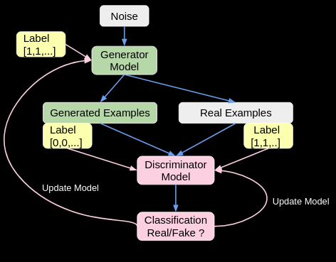

---

<h1 align="center">
  
  Learn GAN from Scratch

</h1>

----

# 💬 How to train GAN:

- First flow: Blue arrow
- Second flow: Pink arrow during model update, when pass the respective labels into loss function. 

> :bulb: For Discriminator, Generated Examples correspond to label `0` and Real Examples correspond to label `1` 

This is the hard part. Read carefully

1. Generator: given noise generate fake data -> `generated_fake_data`
2. Have some ground truth data i.e True Labels
3. Check what the discriminator says about the fake data coming from step 1: 
    - `Discriminator(generated_fake_data)` -> Real/Fake i.e `Dis_result_for_Gen_output` (probabilistic output)
4. **Train Generator:**  We use the True labels here and don't train the discriminator because we want the generator to make things the discriminator classifies as true. The generator should generate fake data such that they are as close as to real data. So the Discriminator accepts them as Real data. 
    - `Gen_Loss = loss(Dis_result_for_Gen_output, True Label)`
    - `Gen_loss.backward()`

5. **Train Discriminator** 
   1. **On the True data:** The discriminator should be able to identify the real data. Pass in a batch of data from the true data set with a vector of all one labels
   2. **On the Fake Generated data:** Pass our generated data into the discriminator, with `detached weights`, and `zero` labels. Because Discriminator should be able to identify the fake data as zero label. Thus dis_loss is average of `True_Dis_Loss and` and `Fake_Dis_Loss` i.e (`generator_discriminator_loss`).

> :bulb: The discriminator is trying to learn to distinguish `real` data from `fake` generated data. The labels while training the discriminator need to represent that, i.e. one when our data comes from the real data set and zero when it is generated by our generator.

## :star: Why detach gradients during training Discriminator?

We do this because we are not training the `Generator`. We are just focused on the discriminator. Detaching ensures the Generator gradient will not be updated when  `discriminator_loss.backward()` is executed.

# GAN Stabilizing issues:

## Early Stopping

Another frequent mistake that you may encounter in GANs training is to stop the training as soon as you see the Generator or Discriminator loss increasing or decreasing abruptly. Often the losses go up or down almost randomly, and there is nothing wrong with that. Keeping an eye on the quality of the generated images during training, as a visual understanding is often more meaningful than some loss numbers

## Mode Collapse and Learning Rate

If you are dealing with GANs, you will know for sure what `Mode Collapse` is. It consists in the generator “collapsing” and always generating a single image for every possible latent vector fed as input. It is a fairly common obstacle in GAN training, and in some cases it can become quite annoying.

The most straight forward solution is to try and **tune the learning rate of the GAN**, this I could always overcome this obstacle changing this particular hyperparameter. As a rule of thumb, when dealing with Mode Collapse, try and use a lower learning rate and restart the training from scratch.

The learning rate is one of the most important hyperparameter, if not the most, as even small changes of it can lead to radical changes during training. Usually you can allow higher learning rates when using larger batch sizes, but being on the conservative side was almost always a safe choice.

There are other ways to combat Mode Collapse, such as **Feature Matching and Minibatch Discrimination**.

## Label Smoothing

Another method to achieve the same goal is `label smoothing`, which is even more easy and straight forward to understand and implement: if the label set for real images is `1`, we change it to a lower value, like `0.9`. This solution discourages the discriminator from **being overconfident** about its classification, or in other words from relying on a very limited set of features to determine if an image is real or fake. 

## :star: TTUR: Two Time-Scale Update Rule

Choosing different learning rates for the generator and discriminator and that’s it. Choosing a higher learning rate for the discriminator and a lower one for the generator: in this way the generator has to make smaller steps to fool the discriminator and does not choose fast, not precise and not realistic solutions to win the adversarial game. 

Choose `0.0004` for the discriminator and `0.0001` for the generator, and these values worked well for some projects. Keep in mind that you may notice a higher loss for the generator when using TTUR.

For more GAN stabilization tricks check below reference.

----

# Reference:

- :rocket: [Build a Super Simple GAN in PyTorch](https://towardsdatascience.com/build-a-super-simple-gan-in-pytorch-54ba349920e4)
  - [code repo](https://github.com/nbertagnolli/pytorch-simple-gan)
- :fire: [10 Lessons I Learned Training GANs for one Year](https://towardsdatascience.com/10-lessons-i-learned-training-generative-adversarial-networks-gans-for-a-year-c9071159628)

# ToDO

- [ ] [DCGAN](https://pytorch.org/tutorials/beginner/dcgan_faces_tutorial.html)
- [ ] [Adversarial Audio Synthesis - WaveGAN](https://paperswithcode.com/paper/adversarial-audio-synthesis) :rocket:

---

